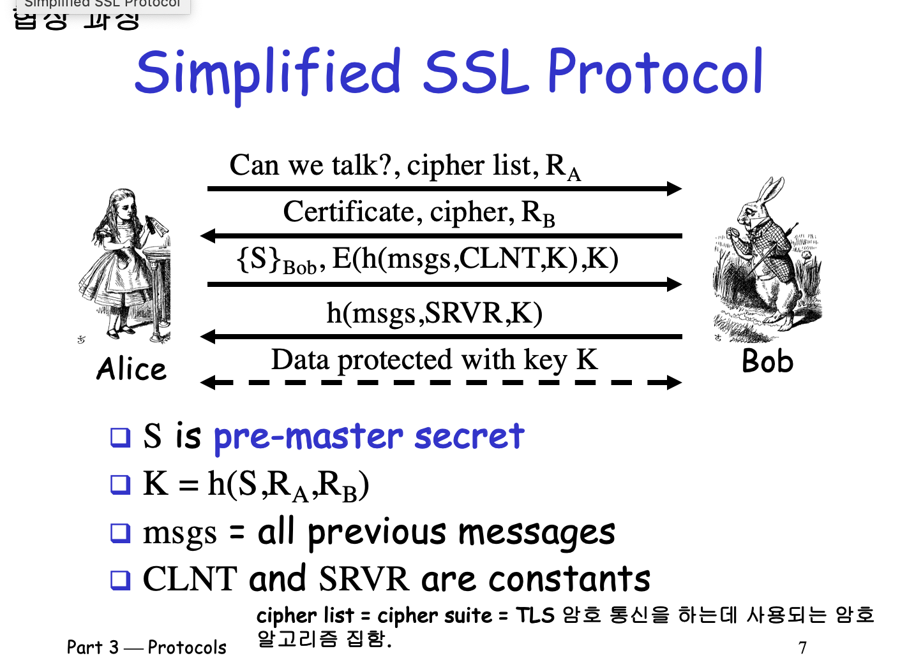
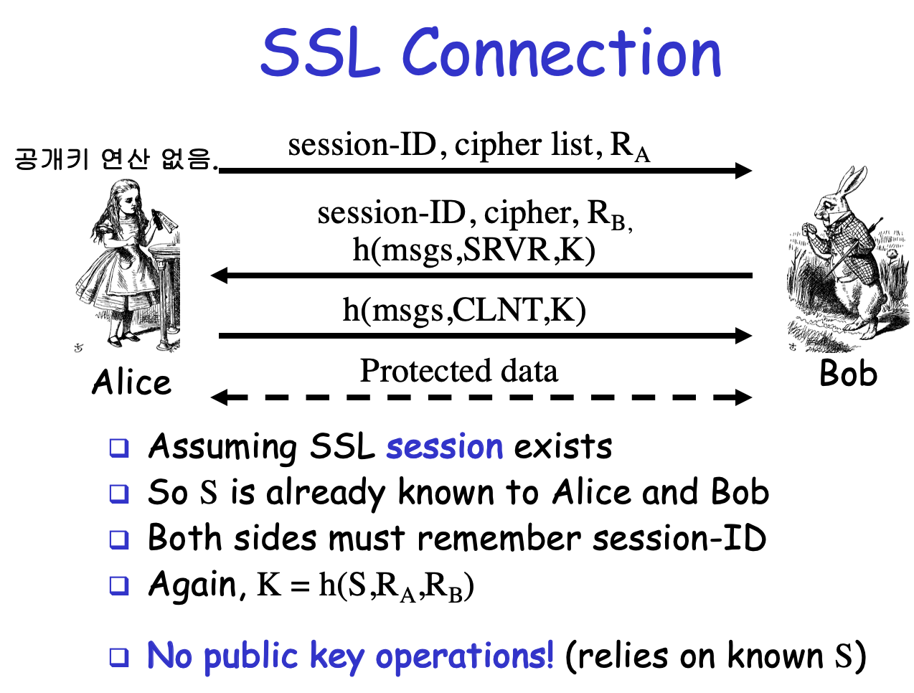

# SSL/TLS

## 1. SSL이란?
SSL (Secure Sockets Layer) 은 클라이언트와 서버 간의 데이터 암호화 통신을 가능하게 하는 프로토콜입니다.
현재는 TLS가 표준이지만, 관습적으로 SSL이라는 표현을 많이 씁니다.

---

## 2. SSL 작동 원리

- **Alice** : 웹사이트에 접속하려는 사용자 (클라이언트)
- **Bob** : 웹사이트 서버 (인증서를 가지고 있음)
- **CA (Certificate Authority)** : 인증서를 발급해주는 신뢰된 기관 (예: DigiCert, Let's Encrypt 등)

1. 클라이언트가 서버에 접속 (Client Hello)
2. 서버가 인증서(Certificate)를 전달 (Server Hello)
3. 클라이언트가 공개키로 pre-master secret(S) 암호화 후 전송
4. 서버가 비밀키로 복호화
5. 서로 S, RA, RB로 세션 키(K) 생성
6. 이후부터는 세션 키(K)로 데이터 암호화 통신

이러한 과정을 **SSL/TLS 핸드셰이크**라고 합니다.

---

## 1단계 : 서버 인증서 준비 (서버 측 작업)

1. Bob(서버)은 자신의 **공개키(Public Key)** 와 **비밀키(Private Key)** 를 생성합니다.
2. 도메인 정보, 조직 정보, 공개키를 포함한 **CSR (인증서 서명 요청서)** 를 생성합니다.
3. 생성한 CSR을 CA에 제출합니다.

#### 💡 비밀키는 서버가 생성하고 외부에 절대 노출되지 않아야 합니다.

비밀키가 유출되면
- 암호화된 데이터를 모두 복호화할 수 있게 됨
- 서버를 가장한 피싱 사이트 생성 가능
- 중간자 공격(Man-in-the-Middle Attack)에 취약해짐
- 모든 HTTPS 통신의 보안이 무력화됨

따라서 비밀키는 반드시 안전한 위치에 보관하고, 접근 권한을 엄격히 제한해야 합니다.

---

## 2단계 : CA가 인증서 발급

1. CA는 Bob이 진짜 도메인 소유자인지 아래 방법 중 하나를 통해 확인합니다.
   - DNS에 특정 레코드 등록
   - 서버에 파일 업로드
   - 이메일 인증

2. CA는 서버 정보를 검증한 후 Bob의 공개키, 도메인 정보, 유효기간, 기타 메타데이터를 하나의 문서로 만듭니다.

3. CA는 이 문서를 **CA의 비밀키**로 암호화(서명)합니다.
   - 이렇게 만들어진 서명이 포함된 문서가 바로 "인증서"
   - 따라서 CA의 공개키로만 복호화 가능

4. 서버는 이 인증서를 웹서버에 설치합니다.

#### 💡 인증서 서명의 의미
- CA가 비밀키로 암호화했다는 것은 "이 서버는 검증되었다"는 CA의 공식 보증
- 브라우저는 내장된 CA의 공개키로 복호화가 성공하면 이 보증을 신뢰

---

## 3단계: 클라이언트가 서버 접속 (Client Hello)

### Alice가 Bob 서버에 HTTPS로 접속

클라이언트는 랜덤 데이터와 클라이언트가 지원하는 암호화 방식들을 서버에 보냅니다:
- Client Random (RA) : 랜덤 숫자 (세션 키 생성용)
- Cipher Suite 예시 :
   - `TLS_ECDHE_RSA_WITH_AES_128_GCM_SHA256`
   - `TLS_DHE_RSA_WITH_AES_256_CBC_SHA`
   - `TLS_RSA_WITH_AES_128_CBC_SHA`

---

## 4단계: 서버 응답 (Server Hello)

### 서버가 클라이언트에 응답

서버는 아래 정보들을 클라이언트에 전달합니다.
- Server Random (RB) : 랜덤 숫자 (세션 키 생성용)
- 클라이언트가 보낸 암호화 방식 중에서 하나 선택
- 서버 인증서 (certificate.crt) 전달

#### 💡 RA, RB를 평문으로 전송해도 안전한 이유
- RA, RB 단독으로는 세션 키 생성에 충분하지 않음. S 와 함께 조합되어야만 의미가 있음
- 브라우저는 내장된 CA의 공개키로 복호화가 성공하면 이 보증을 신뢰

#### 💡 매번 새로운 RA, RB를 생성하는 이유
- 같은 S값이 재사용되더라도 매번 다른 세션 키가 생성되어 유일성을 보장장
- 이전 세션이 노출되더라도 다른 세션에는 영향 없음

---

## 5단계: 클라이언트가 인증서 검증 및 Pre-Master Secret 생성

### 1. 클라이언트가 서버 인증서 검증

- 도메인 이름 일치 확인
- 유효기간 확인
- 인증서의 서명이 신뢰할 수 있는 CA인지 확인  
  (브라우저에 내장된 Root CA 목록과 비교)

#### 💡 CA 인증서 검증 프로세스
1. 브라우저는 내장된 CA 리스트에서 해당 인증서 발급 기관을 확인
   - CA 리스트에 없다면 사용자에게 보안 경고 메시지 출력
   - CA 리스트에 있다면 해당 CA의 공개키로 인증서 복호화 시도

2. CA의 공개키로 인증서가 복호화된다면
   - 해당 인증서가 신뢰할 수 있는 CA에 의해 발급되었음을 확인
   - 접속한 서비스가 공인된 인증기관에 의해 보증되었다는 것을 의미

### 2. 클라이언트가 Pre-Master Secret 생성

- 랜덤 비밀값 S 생성
- 서버로부터 받은 인증서에 포함된 서버의 공개키로 S를 암호화
- 암호화된 S를 서버에 전송

---

## 6단계: 서버가 Pre-Master Secret 복호화 및 세션 키 생성

1. 서버는 자신의 비밀키로 S를 복호화합니다.
   - 1단계에서 생성하고 안전하게 보관해둔 비밀키 사용
   - 이 비밀키는 인증서에 포함된 공개키와 쌍을 이루는 키
   - 오직 서버만이 이 비밀키를 가지고 있으므로, 서버만이 S를 복호화할 수 있음

2. 양쪽 모두가 다음을 이용해 **세션 키 K 생성**
   - `K = h(S, RA, RB)`
   - h는 해시 함수를 의미
   - S : 클라이언트가 생성한 Pre-Master Secret
   - RA : 클라이언트가 생성한 랜덤값 
   - RB : 서버가 생성한 랜덤값

💡 이 과정의 의미:
- 클라이언트와 서버 모두 동일한 S, RA, RB 값을 가지게 됨
- 따라서 양쪽에서 생성한 세션 키 K는 동일한 값이 됨
- 이후의 모든 통신은 이 대칭키 K로 암호화/복호화
- 공개키/비밀키 방식보다 훨씬 빠른 대칭키 암호화 사용 가능

이 세션 키 K는 이후 데이터 암호화에 사용됨

---

## 7단계: 핸드셰이크 완료 및 암호화 통신 시작

### 서로 통신 준비 완료

1. 클라이언트와 서버는 `Change Cipher Spec` 메시지를 교환
   - "이제부터 협상된 암호화 방식과 세션 키를 사용하겠다"는 신호
   - 이 메시지 이후의 모든 통신은 세션 키(K)로 암호화됨
   - 핸드셰이크 과정에서 마지막 평문 메시지

2. `Finished` 메시지를 교환 → 핸드셰이크 성공 여부 최종 확인
   - 이미 암호화된 상태로 전송되는 첫 메시지
   - 상대방이 세션 키로 올바르게 복호화할 수 있는지 확인

3. 이후 모든 데이터는 **세션 키 K로 암호화되어 전송**

이것으로 SSL/TLS 핸드셰이크가 완료됩니다.

#### 💡 세션 재사용

- 이미 핸드셰이크를 한 적 있는 클라이언트는 **session ID** 와 **S** 를 저장하고 있음
- 서버도 해당 session ID를 기억하고 있다면 공개키 암호화 과정을 생략할 수 있어 빠르고 효율적인 재접속이 가능하다.

---

## 8단계: 세션 종료 및 키 폐기

### 통신 종료 절차

1. 데이터 전송이 완료되면 양측은 `Close Notify` 메시지를 교환
2. SSL 통신이 종료되었음을 서로에게 알림
3. 사용했던 세션 키(K)를 즉시 폐기

#### 💡 세션 키 폐기의 의미
- 세션의 수립부터 종료까지 아주 짧은 시간 안에 이루어짐
- 설령 암호가 해독되더라도 세션 키는 이미 폐기된 상태
- 이런 임시성이 SSL/TLS 통신의 보안성을 더욱 강화

---

#### 💡 공개키/비밀키 암호화의 두 가지 사용 방식

1. 기밀성(Confidentiality)을 위한 암호화
   - 공개키로 암호화 → 비밀키로 복호화
   - 용도: 데이터를 안전하게 전달할 때
   - 예시: 클라이언트가 pre-master secret(S)을 서버에 전송할 때
   - 특징: 비밀키 소유자만 복호화 가능

2. 진정성(Authenticity)을 위한 전자서명
   - 비밀키로 암호화 → 공개키로 복호화
   - 용도: 데이터의 출처를 증명할 때
   - 예시: CA가 인증서에 서명할 때
   - 특징: 비밀키 소유자가 생성한 것임을 증명 가능

이렇게 양방향으로 사용 가능한 특성 때문에 SSL/TLS에서
- 데이터 전송 시에는 기밀성을 위해 공개키로 암호화
- 인증서 서명 시에는 진정성을 위해 비밀키로 암호화

---

#### 💡SSL/TLS가 대칭키와 공개키를 조합해서 사용하는 이유

1. 공개키 암호화의 한계
   - 높은 컴퓨팅 파워 필요
   - 많은 접속이 몰리는 서버에서는 큰 비용 발생
   - 전체 통신을 공개키로 하기에는 비효율적

2. 대칭키 암호화의 한계
   - 암호화 키를 상대방과 공유해야 함
   - 암호화되지 않은 인터넷으로 키를 전송하기는 위험
   - 키 교환 과정의 보안이 취약

3. 두 방식의 장점을 조합한 해결책
   - 처음에만 공개키로 대칭키(세션 키)를 안전하게 교환
   - 이후 실제 데이터는 빠른 대칭키로 암호화
   - 보안성과 성능을 모두 확보
---
